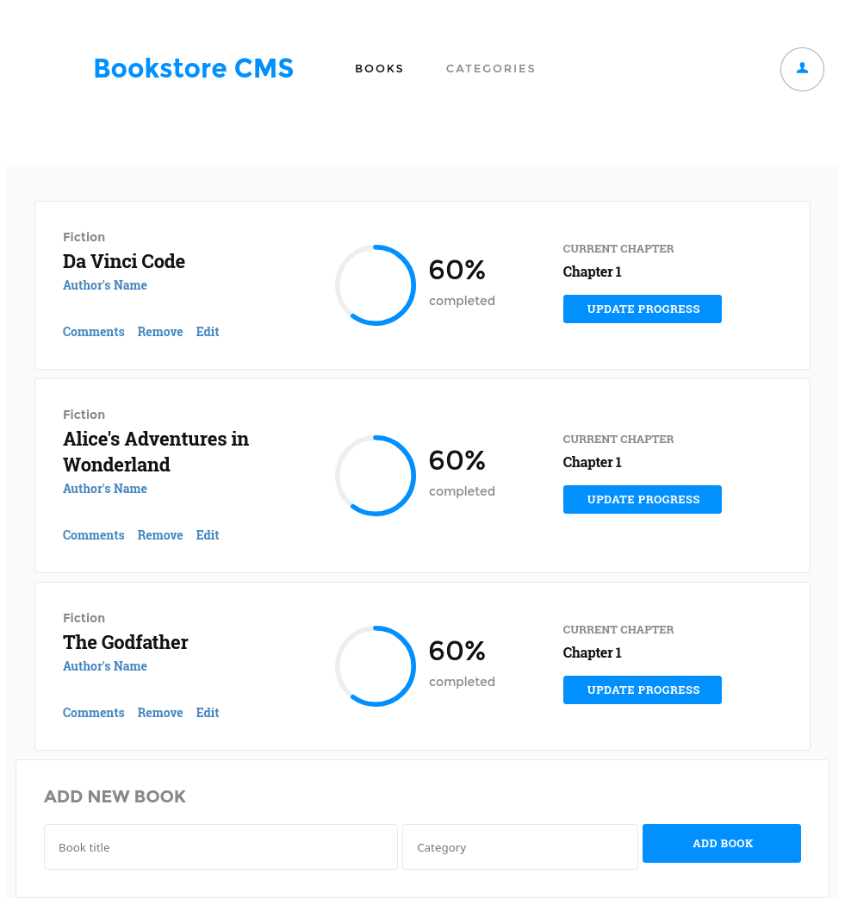

<p align="center">
  <a href="https://www.microverse.org/">
    
  </a>
  <a href="https://github.com/enionsouza/bookstore">
    
  </a>
  <a href="https://github.com/enionsouza/bookstore">
    
  </a>
</p>


# Bookstore

## About

The Bookstore is a website similar to the ["Awesome Books"](https://github.com/VanessaAoki/AwesomeBooks/) website built in the previous Microverse module (see [live version](https://rawcdn.githack.com/VanessaAoki/AwesomeBooks/3ca746caa2332a3bc69bb2846545a09298e8045f/index.html)). My goal here is to create an MVP version of it that allows the user to:

-    Display a list of books.
-    Add a book.
-    Remove a selected book.

By building this application, I will learn how to use React and Redux.

A screenshot of the Books page of the app is presented below:

<p align="center">
    
</p>

## Built With

- HTML, CSS, JavaScript;
- ReactJS, ReduxJS;
- VisualStudio Code, Git, & GitHub;

## Pre-requisites

- NodeJs (v. 14.17)
- YarnJs (v. 1.22.10)
- Git

<!-- ## Live Demo

Live demos for this project can be found on the following Cloud Platforms:
- [Heroku](https://bookstore-enionsouza.herokuapp.com/),
- [Netlify](https://bookstore-enionsouza.netlify.app), and
- [GitHub Pages](https://enionsouza.github.io/bookstore/). -->

## Getting Started

To run this project, you only need a computer with a browser installed, and follow these steps:


1. In your terminal, in the folder of your preference, type the following bash command to clone this repository:

```sh
git clone git@github.com:enionsouza/bookstore.git
```

2. Now that you have already cloned the repo run the following commands to get the project up and running:
```sh
cd bookstore
yarn
yarn start
```

## Author

👤 **Ênio Neves de Souza**

- GitHub: [@enionsouza](https://github.com/enionsouza)
- Twitter: [@enionsouza](https://twitter.com/enionsouza)
- LinkedIn: [Enio Neves de Souza](https://www.linkedin.com/in/enio-neves-de-souza/)

## 🤝 Contributing

Contributions, issues, and feature requests are welcome!

Feel free to check the [issues page](https://github.com/enionsouza/bookstore/issues).

## Show your support

Give a ⭐️ if you like this project!

## 📝 License

This project is [MIT](./LICENSE) licensed.